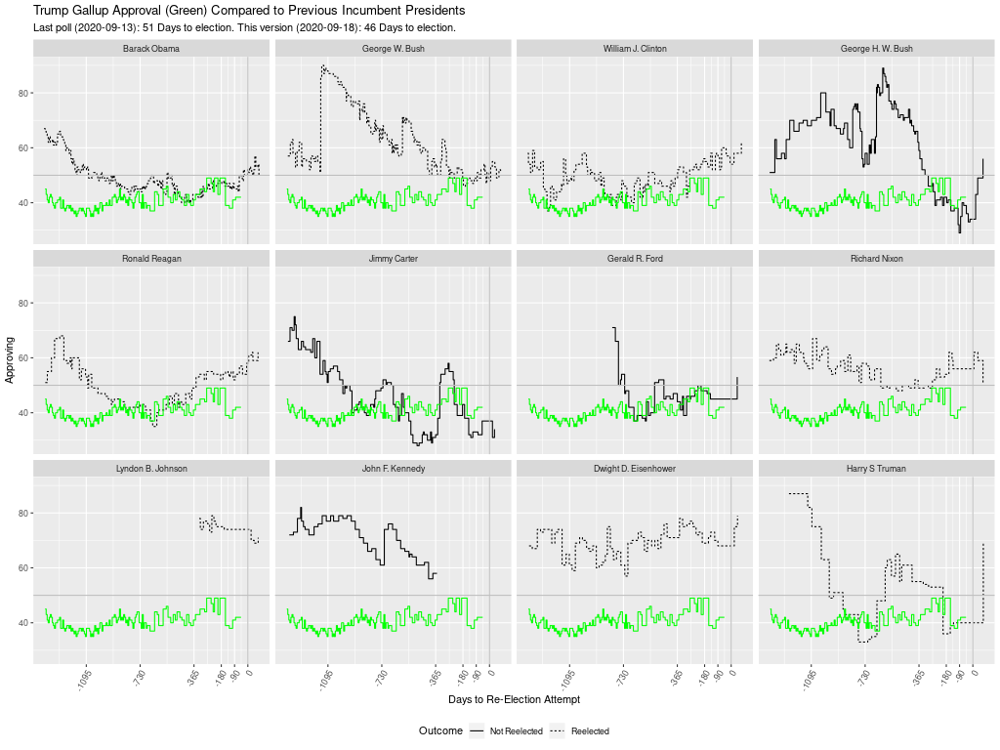
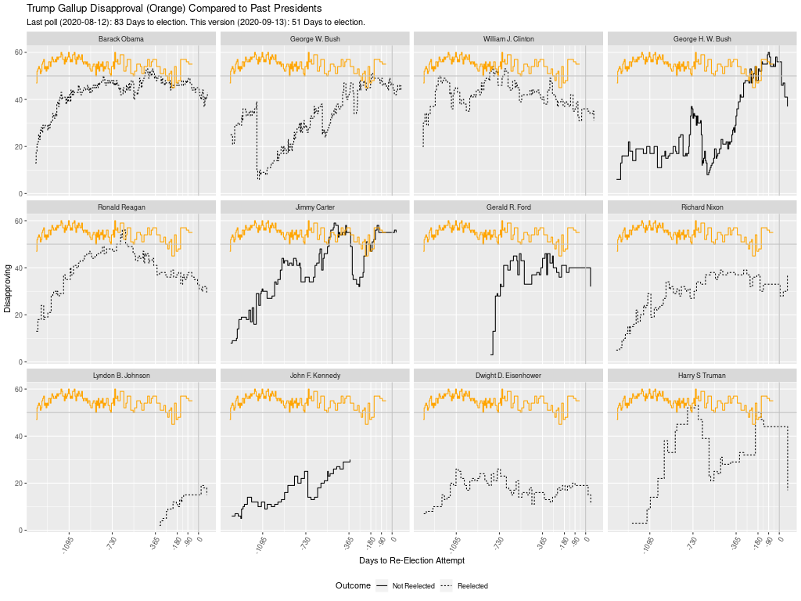
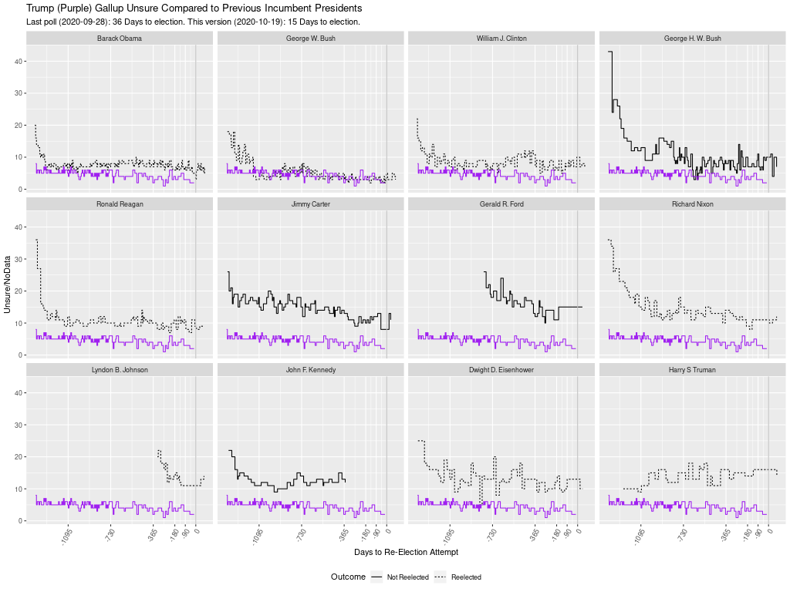
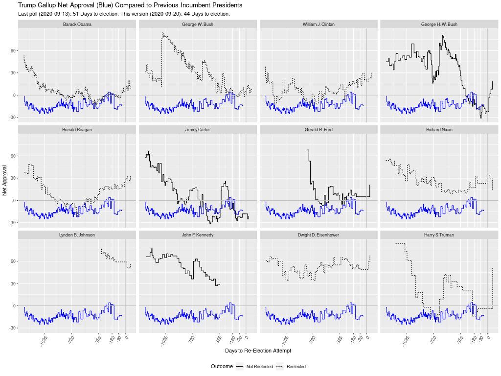

Comments to [mash@econs.umass.edu](mailto:mash@econs.umass.edu)

**How Trump compares with past presidents**, the lower panel of
  [https://projects.fivethirtyeight.com/trump-approval-ratings/](https://projects.fivethirtyeight.com/trump-approval-ratings/),
  plots pairwise time series of the dis/approval of each post-war
  president and the dis/approval of Donald Trump starting from the
  first day of each President's presidency.

The fivethirtyeight plot might be more useful, especially in election
season, if it were plotted as a countdown of days to the re-election
attempt instead of a count of days from the first day of the
presidency.

The countdown is particularly relevant to compare presidents whose
terms did not begin immediately following an election, i.e., Harry
Truman because of the death in office of FDR, LBJ because of the
assassination of JFK, and Gerald Ford because of the resignation of
Richard Nixon. For example, the fivethirtyeight version matches Trump
approaching the November 2020 election with LBJ well into his second
term (when the Vietnam War had been widely recognized as a disaster),
which gives little insight into how in summer and fall 1964 LBJ was
rolling towards a landslide reelection. Gerald Ford's line begins at
left with his first day in office, which was roughly 1.5 years into
the 4-year term that began with Nixon's 1972 re-election; thus, it is
hard to compare Ford's approval as Ford's re-election attempt
approached with that of other presidents.

The R code:

- reads [Presidential Job Approval data](https://www.presidency.ucsb.edu/statistics/data/presidential-job-approval)
  (reference to Gallup) maintained in a Google Sheets file by the [UCSB American
  Presidency Project](https://www.presidency.ucsb.edu/).

    - A one-time authorization may be required for the googlesheets4 R
      package to have access to Google Sheets.

    - If the Google Sheets cannot be read in R, there is alternative
      code to use an xlsx spreadsheet manually downloaded from the
      Google Sheet.

- plots presidential approval with a countdown to attempted
  reelection with t=0 at the date of the re-election attempt.

