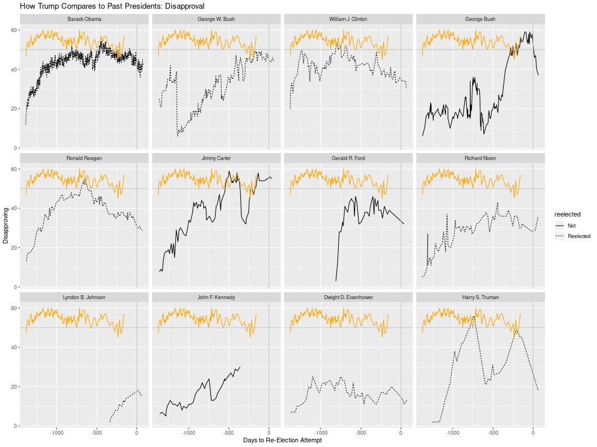

# trump-approval

Comments to [mash@econs.umass.edu](mailto:mash@econs.umass.edu)

**How Trump compares with past presidents**, the lower panel of
  [https://projects.fivethirtyeight.com/trump-approval-ratings/](https://projects.fivethirtyeight.com/trump-approval-ratings/),
  plots pairwise time series of the dis/approval of each post-war
  president and the dis/approval of Donald Trump starting from the
  first day of each presidency.

The fivethirtyeight plot might be more useful, especially in election
season, if it were plotted as a countdown of days to the re-election
attempt instead of a count of days from the first day of the
presidency.

The countdown would be particularly relevant to compare presidents
whose term did not begin immediately following election, e.g., Harry
Truman because of the death of FDR, LBJ because of the assassination
of JFK, and Gerald Ford because of the resignation of Richard
Nixon. As the fivethirtyeight version is organized, we match Trump
approaching the November 2020 election with, for example, LBJ well
into his second term (when the Vietnam War had been widely recognized
as a disaster), which gives little insight into how LBJ was rolling
towards a landslide reelection in summer of 1964. Gerald Ford's line
begins at his t=0, which was something like 1.5 years into the 4-year
term that began with Nixon's election; thus, it is hard to calibrate
Ford's approval against other presidents as re-election attempt
approached.

The R code:

- reads [Presidential Job Approval data](https://www.presidency.ucsb.edu/statistics/data/presidential-job-approval)
  (reference to Gallup) maintained in a Google Sheets file by the [UCSB American
  Presidency Project](https://www.presidency.ucsb.edu/).

    - A one-time authorization may be required for the googlesheets4 R
      package to have access to Google Sheets.

    - If the Google Sheets cannot be read in R, there is alternative
      code to use an xlsx spreadsheet manually downloaded from the
      Google Sheet.

- corrects a misspelling of Barack Obama's name ("Barak") on the UCSB spreadsheet

- plots presidential approval during with a countdown to attempted
  reelection with t=0 at the date of the re-election attempt.

